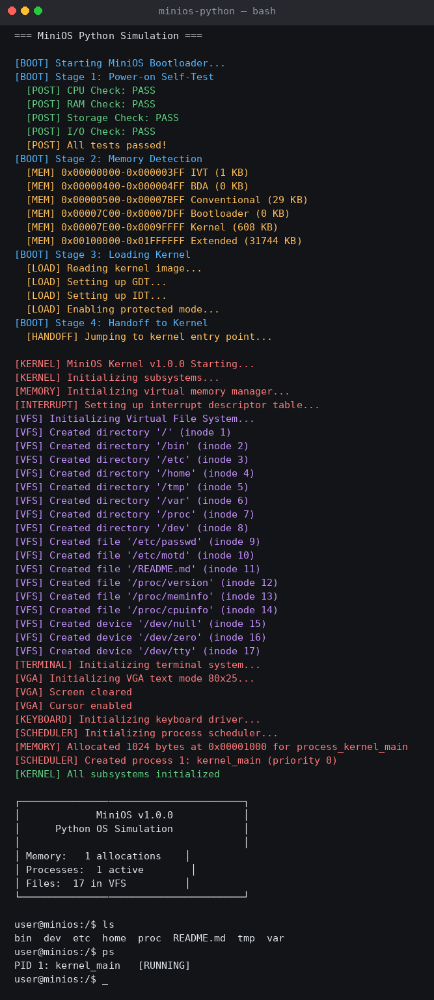
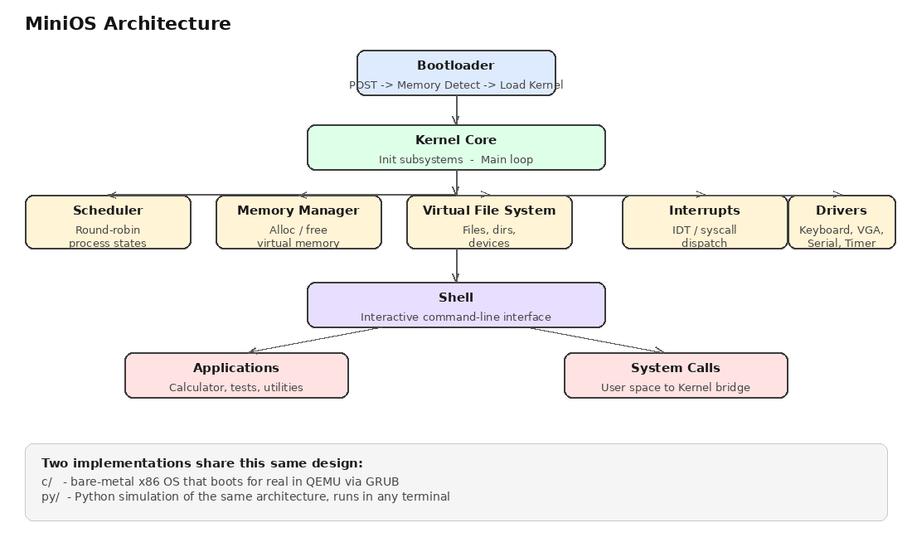
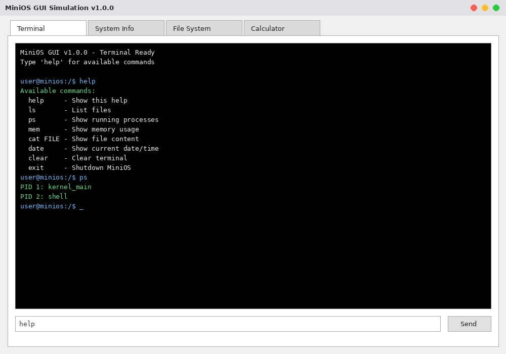

<div align="center">

#  MiniOS

**A small operating system, built twice — once for real hardware, once for learning.**

MiniOS is an educational operating system project with two independent implementations that share the same architecture: a **bare-metal x86 kernel in C/Assembly** that actually boots in QEMU, and a **Python simulation** of the same kernel you can run instantly in any terminal.

[](./c)
[](./py)
[](#-getting-started)
[](#-license)
[](#-about-this-project)

</div>

>  **About this project:** MiniOS started as an **Operating Systems course project**. It's a learning exercise, not production software — there are almost certainly rough edges and open bugs. It's shared here as-is so others can learn from it, poke at it, fix things, or build on top of it. **Feel free to use it, fork it, and take it in whatever direction you want.**

<p align="center">
  
</p>

---


---

##  Overview

MiniOS exists to make core operating-system concepts approachable. Rather than reading about a scheduler or a virtual file system, you can boot one, poke at it from a shell, and read straightforward source code that implements it.

| | [`c/`](./c) — Bare-metal kernel | [`py/`](./py) — Python simulation |
|---|---|---|
| **What it is** | A real, Multiboot-compliant x86 kernel | A faithful simulation of the same design |
| **Runs on** | QEMU or real x86 hardware, via GRUB | Any machine with Python 3.8+ |
| **Best for** | Learning boot process, memory layout, and low-level drivers | Reading and modifying OS logic without a toolchain |
| **Includes a GUI** | No (VGA text mode) | Yes, a Tkinter desktop shell |

Both editions implement the same mental model: **bootloader → kernel → subsystems (memory, scheduler, VFS, drivers) → shell → applications.**

---

##  Features

- **Process Management** — round-robin scheduler with priorities and process states
- **Memory Management** — allocation and tracking (best-fit with block merging in C; virtual memory simulation in Python)
- **Virtual File System** — directories, files, and device nodes (`/dev/null`, `/dev/tty`, …)
- **System Calls** — a simulated syscall interface bridging user space and kernel space
- **Interactive Shell** — a command-line interface with familiar Unix-like commands
- **Device Drivers** — keyboard, VGA text-mode display, serial port, timer
- **Applications** — a calculator, performance/stress tests, and utility programs
- **Desktop GUI** *(Python edition)* — a tabbed Tkinter interface for the terminal, system stats, file browser, and calculator

---

##  Architecture

Both implementations follow the same layered design, from power-on to the shell prompt:

<p align="center">
  
</p>

1. **Bootloader** runs power-on self-tests, detects memory, and hands off to the kernel.
2. **Kernel Core** brings up every subsystem, then enters its main loop.
3. **Subsystems** (scheduler, memory manager, VFS, interrupts, drivers) run independently and are exposed to user space through system calls.
4. **Shell** gives you an interactive prompt on top of all of it.
5. **Applications** (like the calculator) run as ordinary scheduled processes.

---

##  Screenshots

<table>
<tr>
<td width="50%">

**Boot sequence** — POST checks, memory map detection, VFS initialization, and scheduler startup, captured straight from a real run:


</td>
<td width="50%">

**Desktop GUI** *(Python edition)* — a tabbed Tkinter window with a live terminal, system info, file browser, and calculator, mirroring the shell you see above:



</td>
</tr>
</table>

---

##  Getting Started

### Python Simulation (fastest way to try it)

No external dependencies required.

```bash
cd py
python main.py
```

Or with the provided Makefile:

```bash
cd py
make run          # boot the OS simulation
make shell        # jump straight into the shell
make calculator   # launch the calculator app
make test         # run the test suite
```

To try the desktop GUI (requires `tkinter`, usually bundled with Python):

```bash
cd py
python launch_gui.py
```

### C / Bare-Metal Kernel

This edition compiles to a real kernel image and boots inside QEMU (or on real hardware).

**Prerequisites**

```bash
# An i686-elf cross-compiler toolchain, GRUB tools, and QEMU
sudo apt-get install gcc-multilib grub-pc-bin grub-common xorriso qemu-system-x86
```

You'll also need an `i686-elf` cross-compiler (`gcc`, `as`, `ld`) on your `PATH` — see the [OSDev cross-compiler guide](https://wiki.osdev.org/GCC_Cross-Compiler) if you don't have one yet.

**Build and run**

```bash
cd c
make          # builds minios.kernel and packages minios.iso
make run      # boots the ISO in QEMU
make clean    # removes build artifacts
```

---

##  Shell Commands

Both editions expose a similar set of shell commands:

| Command | Description |
|---|---|
| `help` | List available commands |
| `ls` | List files in the current directory |
| `cat <file>` | Print a file's contents |
| `ps` | Show running processes |
| `mem` | Show memory usage |
| `echo <text>` | Print text back to the terminal |
| `date` | Show the current date and time |
| `clear` | Clear the terminal |
| `exit` / `shutdown` | Halt the OS |

The Python edition also ships a standalone **calculator** app (`let x = 5`, trig/log functions, variable tracking) reachable via `make calculator` or the GUI's Calculator tab.

---

##  Project Structure

```
MiniOS/
├── c/                      # Bare-metal x86 kernel (C + x86 Assembly)
│   ├── src/
│   │   ├── boot/           # boot.asm, gdt.asm, idt.asm
│   │   ├── kernel/         # kernel, memory, scheduler, interrupts, terminal
│   │   ├── fs/             # virtual file system + initial ramdisk
│   │   ├── drivers/        # keyboard, VGA, serial
│   │   ├── lib/            # freestanding stdio/stdlib/string
│   │   └── apps/           # shell, calculator, test tasks
│   ├── include/            # matching headers for every module above
│   ├── scripts/            # grub.cfg, linker script
│   └── Makefile
│
├── py/                     # Python simulation of the same architecture
│   ├── src/
│   │   ├── boot/           # bootstrap.py
│   │   ├── kernel/         # kernel, memory, scheduler, interrupts, terminal, syscalls
│   │   ├── fs/             # vfs.py, initrd.py
│   │   ├── drivers/        # keyboard, VGA, serial
│   │   ├── lib/            # stdio, stdlib, string helpers
│   │   └── apps/           # shell, calculator, test tasks
│   ├── include/            # shared constants and type definitions
│   ├── config/             # boot.cfg, system.cfg
│   ├── tests/              # unit tests (memory, scheduler, filesystem)
│   ├── main.py             # CLI entry point
│   ├── launch_gui.py       # Tkinter GUI entry point
│   └── Makefile
│
└── screenshots/            # images used in this README
```

---

##  Testing

The Python edition includes a unit test suite covering the memory manager, scheduler, and file system:

```bash
cd py
make test
# or directly:
PYTHONPATH=src python -m pytest tests/ -v
```

Coverage reporting is also available via `make coverage`.

---

##  Roadmap

- [ ] Networking stack simulation
- [ ] Multi-user permissions in the VFS
- [ ] Additional userland apps (text editor, package manager)
- [ ] Persistent disk image support for the C kernel

Contributions toward any of these — or anything else that helps someone learn OS internals — are very welcome.

---

##  About This Project

This started as a project for an **Operating Systems course** — the goal was to actually build the concepts (boot process, scheduling, memory management, a file system) rather than just read about them, and to do it twice: once close to the metal in C, once in Python for readability.

Because of that:

- It's a **learning project first**, not a hardened or complete OS. Expect missing edge-case handling, incomplete features, and some rough or unfinished code paths.
- Testing has been informal — the Python unit tests cover the basics, but plenty of behavior hasn't been exercised thoroughly.
- The C kernel targets QEMU/education, not real-world hardware compatibility.

**This project is open for anyone to use.** Clone it, study it, fix bugs, rip out pieces for your own OS course project, extend it — whatever's useful to you. If you do find and fix an issue, a pull request is always welcome, but there's no obligation.

---

##  Contributing

Issues and pull requests are welcome. If you're adding a feature, please:

1. Keep the C and Python editions conceptually in sync where it makes sense.
2. Add or update tests under `py/tests/` for Python changes.
3. Describe what you tested (which commands, which platform) in your PR.

---

##  License

This project is intended for educational use. Add your preferred license (e.g. MIT) here.
